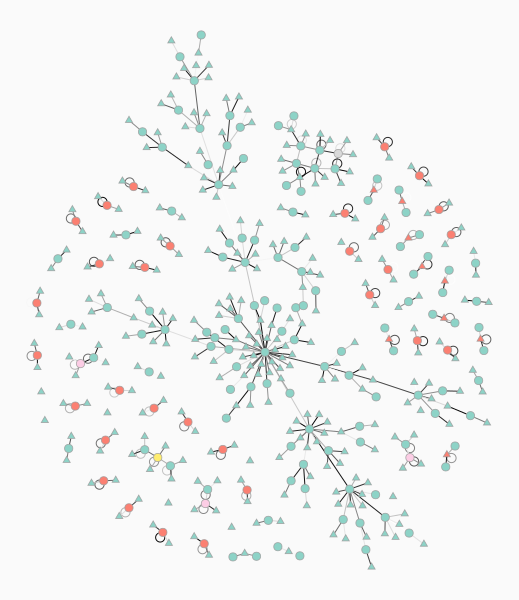

# A Reproducible Computational Workflow for Visualizing Neuronal Circuit Models Using Complex Network Analysis

## Abstract


**Objective**: To present a reproducible workflow for visualizing large-scale neuronal circuit models from multiple structural and functional perspectives, enabling comprehensive exploration of network organization across different analytical dimensions.
**Methods**: Implement graph theory to visualize representative simulation networks via nonparametric statistically inferring modular network structure, reconstructing into nested stochastic block model to find hierarchical partitions and characterize the posterior distribution using centrality-related algorithms. Perform animations for visualizing spatial segregation of the network along with the time evolution via rewiring strategies and SIRS model.
**Results**: The framework generates comprehensive univariate centrality distribution analyses and compares animation algorithms trigger variates across multiple weighted models, including partial CTC loop (*i.e.*, TC2PT), single-regional CTC loop (*i.e.*, max_CTC_plus) and multiple-regional CTC loops (*i.e.*, M1_max_plus, M2aM1aS1a_max_plus, M2M1S1_max_plus). And the in-neighbors rewiring combining SIRS state altering animation algorithms causes the most significant variation in the conditions of edges connected catagorized most detaily (*p* <0.01).
**Conclusion**: This protocol provides a template for reproducible multi-dimentional comparison of neuronal circuit architectures enabling detailed discrimination of network roles through structural weighting and continuous variation patterns across centrality metrics.

## Keywords
neuronal circuits, computational neuroscience, graph theory, SFDP, price_network, stochastic block model (SBM)

## Introduction

Computational neuroscience increasingly relies on complex network analysis to understand brain connectivity and neural circuit organization. The ability to visualize neuronal circuit models from multiple analytical perspectives is essential for interpreting network properties such as centrality, clustering, and community structure in neural systems. However, effective visualization of neuronal circuits presents unique challenges including high-dimensional connectivity, multi-scale organization, and the need for specialized computational tools.

Traditional approaches to community detection in networks often rely on descriptive methods like modularity optimization [3], which can produce misleading results when applied without proper statistical validation [2]. Recent advances in Bayesian stochastic blockmodeling provide a principled framework for inferential community detection that addresses fundamental limitations of purely descriptive approaches [1, 2]. The stochastic block model (SBM), first introduced by Holland et al. [4], has evolved into sophisticated nonparametric frameworks that enable robust inference of mesoscale structure in complex networks [5, 6].

Modern SBM variants accommodate weighted networks [14], hierarchical organization [8], overlapping groups [11], and directed connectivity patterns [20], making them particularly suitable for analyzing neuronal circuit architectures. The development of efficient inference algorithms, including merge-split Markov chain Monte Carlo methods [10] and greedy heuristics [9], enables scalable analysis of large-scale networks while maintaining statistical rigor. Furthermore, nonparametric approaches eliminate the need for a priori specification of model complexity, allowing data-driven determination of optimal community structure [5, 7, 8].

Hierarchical block structures provide a natural framework for understanding multi-scale organization in neuronal circuits, where functional modules exist at multiple levels of granularity [8, 17]. This hierarchical perspective aligns with the biological reality of neural systems, which exhibit organization from individual neurons to microcircuits, brain regions, and whole-brain networks. The integration of weighted stochastic block models [14] with structural edge weighting enables enhanced discrimination of network roles while preserving topological constraints.

Here we present a systematic framework that leverages these advanced community detection methodologies to enable researchers to view large-scale neuronal networks from different structural and functional angles, providing complementary insights into network architecture and functional roles. Our approach integrates graph-theoretical analysis with Bayesian stochastic blockmodeling to create a multi-dimensional perspective on neuronal circuit construction. By applying diverse centrality measures, hierarchical community detection, and dynamic modeling across multiple circuit architectures, we demonstrate how different analytical lenses reveal distinct aspects of the same underlying network structure.

## Results

### Network Topology and Community Structure Visualization

**Figure 1**: Cairo plots, nested stochastic block models, and condensation graphs for four representative neuronal circuit models (*i.e.*, TC2CT, TC2IT2PTCT, TC2IT4_IT2CT, TC2PT) demonstrating the structural organization and community structure of each network. 

<div style="display: flex; flex-wrap: wrap; justify-content: space-between; gap: 10px;">
<div style="flex: 0 0 48%; text-align: center;">

<p style="font-size: 0.9em; margin-top: 5px;"><strong>(A-1) TC2CT</strong> - Direct thalamocortical to corticothalamic connectivity</p>
</div>

<div style="flex: 0 0 48%; text-align: center;">

<p style="font-size: 0.9em; margin-top: 5px;"><strong>(A-2) TC2CT Main Layout</strong> - population nodes layout from Direct thalamocortical to corticothalamic connectivity</p>
</div>

<div style="flex: 0 0 48%; text-align: center;">

<p style="font-size: 0.9em; margin-top: 5px;"><strong>(A-3) TC2CT Input Nodes Layout</strong> - input nodes layout from Direct thalamocortical to corticothalamic connectivity</p>
</div>

<div style="flex: 0 0 48%; text-align: center;">

<p style="font-size: 0.9em; margin-top: 5px;"><strong>(A-4) TC2CT Nested Stochastic Block Model</strong> - Layered connectivity structure</p>
</div>

<div style="display: flex; flex-direction: column; gap: 20px; margin: 20px 0;">

<p style="font-size: 0.9em; margin-top: 5px;"><strong>(A-5) TC2CT Condensation Graph</strong> - Simplified representation of the network structure</p>
</div>

<div style="flex: 0 0 48%; text-align: center;">

<p style="font-size: 0.9em; margin-top: 5px;"><strong>(B-1) TC2IT2PTCT</strong> - Complex multi-layer interactions</p>
</div>

<div style="flex: 0 0 48%; text-align: center;">

<p style="font-size: 0.9em; margin-top: 5px;"><strong>(B-2) TC2IT2PTCT Nested Stochastic Block Model</strong> - Layered connectivity structure</p>
</div>

<div style="display: flex; flex-direction: column; gap: 20px; margin: 20px 0;">

<p style="font-size: 0.9em; margin-top: 5px;"><strong>(B-3) TC2IT2PTCT Condensation Graph</strong> - Simplified representation of the network structure</p>
</div>

<div style="flex: 0 0 48%; text-align: center;">

<p style="font-size: 0.9em; margin-top: 5px;"><strong>(C-1) TC2IT4_IT2CT</strong> - Layer 4 intratelencephalic pathways</p>
</div>

<div style="flex: 0 0 48%; text-align: center;">

<p style="font-size: 0.9em; margin-top: 5px;"><strong>(C-2) TC2IT4_IT2CT Nested Stochastic Block Model</strong> - Layered connectivity structure</p>
</div>

<div style="display: flex; flex-direction: column; gap: 20px; margin: 20px 0;">

<p style="font-size: 0.9em; margin-top: 5px;"><strong>(C-3) TC2IT4_IT2CT Condensation Graph</strong> - Simplified representation of the network structure</p>
</div>

<div style="flex: 0 0 48%; text-align: center;">

<p style="font-size: 0.9em; margin-top: 5px;"><strong>(D-1) TC2PT</strong> - Thalamocortical to pyramidal tract connectivity</p>
</div>

<div style="flex: 0 0 48%; text-align: center;">

<p style="font-size: 0.9em; margin-top: 5px;"><strong>(D-2) TC2PT Nested Stochastic Block Model</strong> - Layered connectivity structure</p>
</div>

<div style="display: flex; flex-direction: column; gap: 20px; margin: 20px 0;">

<p style="font-size: 0.9em; margin-top: 5px;"><strong>(D-3) TC2PT Condensation Graph</strong> - Simplified representation of the network structure</p>
</div>
</div>

### Centrality Distribution Analysis

**Figure 2**: Individual centrality measure visualizations for the TC2PT neuronal circuit model. This figure displays nine different graph-theoretical centrality algorithms applied to the same network, revealing complementary perspectives on neuronal importance and functional roles: (A)  **Betweenness centrality** Calculate the average number of shortest paths from one vertex to another for each vertex and edge; (B) **Closeness centrality** Calculate the possibly or weighted distance from one vertex to another; (C) **Eigenvector centrality** Calculate the eigenvector of the (weighted) adjacency matrix with the largest eigenvalue of each vertex; (D) **PageRank centrality** Calculate the in-neighbors vertex of sum weight of out-degree edges for each vertex; (E) **Katz centrality** Calculate the the (weighted) adjacency matrix in the nonhomogeneous linear system for each vertex; (F) **HITS Authority** Calculate the authority centralities of each vertex; (G) **HITS Hub** Calculate the (weighted) adjacency matrix with the largest eigenvalue of the cocitation matrix of each vertex; (H) **EigenTrust centrality** Calculate the limite with the normalized trust values in matrix for each vertex ; (I) **Trust_transitivity centrality** Calculate paths with maximum weight, using Dijkstra’s algorithm, to all in-neighbors of a given target between chosen (or all) vertices in the graph;(J)**Centrality Distribution** - Spread of centrality values across the network. 

<div style="display: flex; flex-wrap: wrap; justify-content: space-between; gap: 10px;">
<div style="flex: 0 0 30%; text-align: center;">

<p style="font-size: 0.85em; margin-top: 5px;"><strong>(A) Betweenness</strong> - Information flow control</p>
</div>
<div style="flex: 0 0 30%; text-align: center;">

<p style="font-size: 0.85em; margin-top: 5px;"><strong>(B) Closeness</strong> - Network proximity</p>
</div>
<div style="flex: 0 0 30%; text-align: center;">

<p style="font-size: 0.85em; margin-top: 5px;"><strong>(C) Eigenvector</strong> - Connected to important neurons</p>
</div>
<div style="flex: 0 0 30%; text-align: center;">

<p style="font-size: 0.85em; margin-top: 5px;"><strong>(D) PageRank</strong> - Random walk importance</p>
</div>
<div style="flex: 0 0 30%; text-align: center;">

<p style="font-size: 0.85em; margin-top: 5px;"><strong>(E) Katz</strong> - Influence through paths</p>
</div>
<div style="flex: 0 0 30%; text-align: center;">

<p style="font-size: 0.85em; margin-top: 5px;"><strong>(F) HITS Authority</strong> - Received importance</p>
</div>
<div style="flex: 0 0 30%; text-align: center;">

<p style="font-size: 0.85em; margin-top: 5px;"><strong>(G) HITS Hub</strong> - Distributed importance</p>
</div>
<div style="flex: 0 0 30%; text-align: center;">

<p style="font-size: 0.85em; margin-top: 5px;"><strong>(H) EigenTrust</strong> - Trusted influence</p>
</div>
<div style="flex: 0 0 30%; text-align: center;">

<p style="font-size: 0.85em; margin-top: 5px;"><strong>(I) trust_transitivity</strong> - Global trust computation</p>
</div>
<div style="display: flex; flex-direction: column; gap: 20px; margin: 20px 0;">

<p style="font-size: 0.9em; text-align: center;"><strong>(J) Facet Grid</strong> - Distribution of centrality measures</p>
</div>
</div>

### Dynamic Community Structure Analysis

**Figure 3**: Animated GIF demonstrating the identification of community structure via stochastic block model (SBM) inference. 

<div style="display: flex; flex-direction: column; gap: 20px; margin: 20px 0;">
<div style="text-align: center;">

<p style="font-size: 0.9em; margin-top: 5px;"><strong>(A) TC2CT</strong> - Direct thalamocortical connectivity</p>
</div>
<div style="text-align: center;">

<p style="font-size: 0.9em; margin-top: 5px;"><strong>(B) TC2IT2PTCT</strong> - Multi-layer interactions</p>
</div>
<div style="text-align: center;">

<p style="font-size: 0.9em; margin-top: 5px;"><strong>(C) TC2IT4_IT2CT</strong> - Layer 4 intratelencephalic pathways</p>
</div>
<div style="text-align: center;">

<p style="font-size: 0.9em; margin-top: 5px;"><strong>(D) TC2PT</strong> - Thalamocortical to pyramidal tract</p>
</div>
</div>

### Hierarchical Community Structure Analysis

**Figure 4**:Hierarchical Community Structure Analysis Across Neuronal Circuit Models

The nested stochastic block model (SBM) reveals multi-scale community organization in neuronal circuits, showing how neurons cluster into functional modules at different hierarchical levels. Each panel displays the hierarchical clustering structure for a different circuit model, highlighting the complex modular architecture that underlies neural information processing.

<div style="display: flex; flex-wrap: wrap; gap: 10px; margin: 20px 0;">
<div style="flex: 0 0 32%; text-align: center;">

<p style="font-size: 0.9em; margin-top: 5px;"><strong>(A) TC2PT</strong> - Thalamocortical to pyramidal tract connectivity</p>
</div>
<div style="flex: 0 0 32%; text-align: center;">

<p style="font-size: 0.9em; margin-top: 5px;"><strong>(B) max_CTC_plus</strong> - Direct thalamocortical connectivity</p>
</div>
<div style="flex: 0 0 32%; text-align: center;">

<p style="font-size: 0.9em; margin-top: 5px;"><strong>(C) M1_max_plus</strong> - Complex multi-layer interactions</p>
</div>
<div style="flex: 0 0 32%; text-align: center;">

<p style="font-size: 0.9em; margin-top: 5px;"><strong>(D) M2aM1aS1a_max_plus</strong> - Layer 4 intratelencephalic pathways</p>
</div>
<div style="flex: 0 0 32%; text-align: center;">

<p style="font-size: 0.9em; margin-top: 5px;"><strong>(E) M2M1S1_max_plus</strong> - Direct thalamocortical to corticothalamic connectivity</p>
</div>
</div>

### Univariate Centrality Distribution Analysis

**Figure 5**: Univariate Centrality Distribution Analysis Across Weighted Neuronal Circuit Models

Each subplot presents kernel density estimation (KDE) plots showing the distribution of individual centrality measures for each weighted neuronal circuit model. The enhanced structural weighting reveals continuous variation patterns across multiple centrality metrics, demonstrating improved discriminative power compared to unweighted analyses. These distributions highlight the rich heterogeneity in network roles across different neuronal populations.

<div style="display: flex; flex-wrap: wrap; gap: 10px; margin: 20px 0;">
<div style="flex: 0 0 32%; text-align: center;">

<p style="font-size: 0.85em; margin-top: 5px;">TC2PT PageRank</p>
</div>
<div style="flex: 0 0 32%; text-align: center;">

<p style="font-size: 0.85em; margin-top: 5px;">TC2PT Betweenness</p>
</div>
<div style="flex: 0 0 32%; text-align: center;"> 

<p style="font-size: 0.85em; margin-top: 5px;">TC2PT Closeness</p>
</div>
<div style="flex: 0 0 32%; text-align: center;">

<p style="font-size: 0.85em; margin-top: 5px;">TC2PT Eigenvector</p>
</div>
<div style="flex: 0 0 32%; text-align: center;">

<p style="font-size: 0.85em; margin-top: 5px;">TC2PT Katz</p>
</div>
<div style="flex: 0 0 32%; text-align: center;">

<p style="font-size: 0.85em; margin-top: 5px;">TC2PT HITS Authority</p>
</div>
<div style="flex: 0 0 32%; text-align: center;">

<p style="font-size: 0.85em; margin-top: 5px;">TC2PT HITS Hub</p>
</div>
<div style="flex: 0 0 32%; text-align: center;">

<p style="font-size: 0.85em; margin-top: 5px;">TC2PT Eigentrust</p>
</div>
<div style="flex: 0 0 32%; text-align: center;">

<p style="font-size: 0.85em; margin-top: 5px;">TC2PT Trust Transitivity</p>
</div>
</div>

<div style="display: flex; flex-direction: column; gap: 20px; margin: 20px 0;">

<p style="font-size: 0.9em; text-align: center;"><strong>(A) TC2PT:</strong> Structural weighting reveals continuous variation patterns across multiple centrality metrics, enabling meaningful differentiation of neuronal roles.</p>

<div style="display: flex; flex-wrap: wrap; gap: 10px; margin: 20px 0;">
<div style="flex: 0 0 32%; text-align: center;">

<p style="font-size: 0.85em; margin-top: 5px;">max_CTC_plus PageRank</p>
</div>
<div style="flex: 0 0 32%; text-align: center;">

<p style="font-size: 0.85em; margin-top: 5px;">max_CTC_plus Betweenness</p>
</div>
<div style="flex: 0 0 32%; text-align: center;">

<p style="font-size: 0.85em; margin-top: 5px;">max_CTC_plus Closeness</p>
</div>
<div style="flex: 0 0 32%; text-align: center;">

<p style="font-size: 0.85em; margin-top: 5px;">max_CTC_plus Eigenvector</p>
</div>
<div style="flex: 0 0 32%; text-align: center;">

<p style="font-size: 0.85em; margin-top: 5px;">max_CTC_plus Katz</p>
</div>
<div style="flex: 0 0 32%; text-align: center;">

<p style="font-size: 0.85em; margin-top: 5px;">max_CTC_plus HITS Authority</p>
</div>
<div style="flex: 0 0 32%; text-align: center;">

<p style="font-size: 0.85em; margin-top: 5px;">max_CTC_plus HITS Hub</p>
</div>
<div style="flex: 0 0 32%; text-align: center;">

<p style="font-size: 0.85em; margin-top: 5px;">max_CTC_plus EigenTrust</p>
</div>
<div style="flex: 0 0 32%; text-align: center;">

<p style="font-size: 0.85em; margin-top: 5px;">max_CTC_plus Trust Transitivity</p>
</div>
</div>


<p style="font-size: 0.9em; text-align: center;"><strong>(B) max_CTC_plus:</strong> Direct connectivity model demonstrates substantial variation across centrality measures, supporting detailed network role analysis.</p>

<div style="display: flex; flex-wrap: wrap; gap: 10px; margin: 20px 0;">
<div style="flex: 0 0 32%; text-align: center;">

<p style="font-size: 0.85em; margin-top: 5px;">M1_max_plus PageRank</p>
</div>
<div style="flex: 0 0 32%; text-align: center;">

<p style="font-size: 0.85em; margin-top: 5px;">M1_max_plus Betweenness</p>
</div>
<div style="flex: 0 0 32%; text-align: center;">

<p style="font-size: 0.85em; margin-top: 5px;">M1_max_plus Closeness</p>
</div>
<div style="flex: 0 0 32%; text-align: center;">

<p style="font-size: 0.85em; margin-top: 5px;">M1_max_plus Eigenvector</p>
</div>
<div style="flex: 0 0 32%; text-align: center;">

<p style="font-size: 0.85em; margin-top: 5px;">M1_max_plus Katz</p>
</div>
<div style="flex: 0 0 32%; text-align: center;">

<p style="font-size: 0.85em; margin-top: 5px;">M1_max_plus HITS Authority</p>
</div>
<div style="flex: 0 0 32%; text-align: center;">

<p style="font-size: 0.85em; margin-top: 5px;">M1_max_plus HITS Hub</p>
</div>
<div style="flex: 0 0 32%; text-align: center;">

<p style="font-size: 0.85em; margin-top: 5px;">M1_max_plus EigenTrust</p>
</div>
<div style="flex: 0 0 32%; text-align: center;">

<p style="font-size: 0.85em; margin-top: 5px;">M1_max_plus Trust Transitivity</p>
</div>
</div>


<p style="font-size: 0.9em; text-align: center;"><strong>(C) M1_max_plus:</strong> Complex multi-layer interactions model exhibits rich continuous variation patterns across centrality distributions.</p>

<div style="display: flex; flex-wrap: wrap; gap: 10px; margin: 20px 0;">
<div style="flex: 0 0 32%; text-align: center;">

<p style="font-size: 0.85em; margin-top: 5px;">M2aM1aS1a_max_plus PageRank</p>
</div>
<div style="flex: 0 0 32%; text-align: center;">

<p style="font-size: 0.85em; margin-top: 5px;">M2aM1aS1a_max_plus Betweenness</p>
</div>
<div style="flex: 0 0 32%; text-align: center;">

<p style="font-size: 0.85em; margin-top: 5px;">M2aM1aS1a_max_plus Closeness</p>
</div>
<div style="flex: 0 0 32%; text-align: center;">

<p style="font-size: 0.85em; margin-top: 5px;">M2aM1aS1a_max_plus Eigenvector</p>
</div>

<div style="flex: 0 0 32%; text-align: center;">

<p style="font-size: 0.85em; margin-top: 5px;">M2aM1aS1a_max_plus Katz</p>
</div>
<div style="flex: 0 0 32%; text-align: center;">

<p style="font-size: 0.85em; margin-top: 5px;">M2aM1aS1a_max_plus HITS Authority</p>
</div>
<div style="flex: 0 0 32%; text-align: center;">

<p style="font-size: 0.85em; margin-top: 5px;">M2aM1aS1a_max_plus HITS Hub</p>
</div>
<div style="flex: 0 0 32%; text-align: center;">

<p style="font-size: 0.85em; margin-top: 5px;">M2aM1aS1a_max_plus EigenTrust</p>
</div>
<div style="flex: 0 0 32%; text-align: center;">

<p style="font-size: 0.85em; margin-top: 5px;">M2aM1aS1a_max_plus Trust Transitivity</p>
</div>
</div>


<p style="font-size: 0.9em; text-align: center;"><strong>(D) M2aM1aS1а_max_plus:</strong> Layer 4 intratelencephalic pathways model shows comprehensive centrality coverage with detailed distribution patterns.</p>

<div style="display: flex; flex-wrap: wrap; gap: 10px; margin: 20px 0;">
<div style="flex: 0 0 32%; text-align: center;">

<p style="font-size: 0.85em; margin-top: 5px;">M2M1S1_max_plus PageRank</p>
</div>
<div style="flex: 0 0 32%; text-align: center;">

<p style="font-size: 0.85em; margin-top: 5px;">M2M1S1_max_plus Betweenness</p>
</div>
<div style="flex: 0 0 32%; text-align: center;">

<p style="font-size: 0.85em; margin-top: 5px;">M2M1S1_max_plus Closeness</p>
</div>
<div style="flex: 0 0 32%; text-align: center;">

<p style="font-size: 0.85em; margin-top: 5px;">M2M1S1_max_plus Eigenvector</p>
</div>
<div style="flex: 0 0 32%; text-align: center;">

<p style="font-size: 0.85em; margin-top: 5px;">M2M1S1_max_plus Katz</p>
</div>
<div style="flex: 0 0 32%; text-align: center;">

<p style="font-size: 0.85em; margin-top: 5px;">M2M1S1_max_plus HITS Authority</p>
</div>
<div style="flex: 0 0 32%; text-align: center;">

<p style="font-size: 0.85em; margin-top: 5px;">M2M1S1_max_plus HITS Hub</p>
</div>
<div style="flex: 0 0 32%; text-align: center;">

<p style="font-size: 0.85em; margin-top: 5px;">M2M1S1_max_plus Eigentrust</p>
</div>
<div style="flex: 0 0 32%; text-align: center;">

<p style="font-size: 0.85em; margin-top: 5px;">M2M1S1_max_plus Trust Transitivity</p>
</div>
</div>


<p style="font-size: 0.9em; text-align: center;"><strong>(E) M2M1S1_max_plus:</strong> Direct thalamocortical to corticothalamic connectivity model exhibits comprehensive centrality coverage with detailed distribution patterns.</p>
</div>

### Comparative Neuronal Circuit Dynamics Analysis

**Figure 6**: Comparative Analysis of Neuronal Circuit Dynamics Across Models

This figure presents comprehensive dynamic visualization results comparing basic and advanced implementations across different neuronal circuit models. The analysis includes state propagation dynamics, edge rewiring patterns, and combined state-rewiring interactions, demonstrating the rich temporal evolution of network properties under different simulation paradigms.

<div style="display: flex; flex-wrap: wrap; gap: 10px; margin: 20px 0;">
<div style="flex: 0 0 48%; text-align: center;">

<p style="font-size: 0.9em;">TC2PT Dynamic</p>
</div>
<div style="flex: 0 0 48%; text-align: center;">

<p style="font-size: 0.9em;">TC2PT Dynamic Adv</p>
</div>
</div>

<div style="display: flex; flex-direction: column; align-items: center; margin: 12px 0;">

<p style="font-size: 0.9em; text-align: center; margin-top: 8px;">Pair: gt_dynamic vs gt_dynamic_adv</p>
</div>

<div style="display: flex; flex-wrap: wrap; gap: 10px; margin: 20px 0;">
<div style="flex: 0 0 48%; text-align: center;">

<p style="font-size: 0.9em;">Max CTC Plus State</p>
</div>
<div style="flex: 0 0 48%; text-align: center;">

<p style="font-size: 0.9em;">Max CTC Plus State Adv</p>
</div>
</div>

<div style="display: flex; flex-direction: column; align-items: center; margin: 12px 0;">

<p style="font-size: 0.9em; text-align: center; margin-top: 8px;">Pair: gt_state vs gt_state_adv</p>
</div>

<div style="display: flex; flex-wrap: wrap; gap: 10px; margin: 20px 0;">
<div style="flex: 0 0 48%; text-align: center;">

<p style="font-size: 0.9em;">M1 Max Plus Combined</p>
</div>
<div style="flex: 0 0 48%; text-align: center;">

<p style="font-size: 0.9em;">M1 Max Plus Combined Adv</p>
</div>
</div>

<div style="display: flex; flex-direction: column; align-items: center; margin: 12px 0;">

<p style="font-size: 0.9em; text-align: center; margin-top: 8px;">Pair: gt_state_dynamic vs gt_state_dynamic_adv</p>
</div>

<div style="display: flex; flex-wrap: wrap; gap: 10px; margin: 20px 0;">
<div style="flex: 0 0 32%; text-align: center;">

<p style="font-size: 0.9em;">M2aM1aS1a Max Plus Dynamic</p>
</div>
<div style="flex: 0 0 32%; text-align: center;">

<p style="font-size: 0.9em;">M2aM1aS1a Max Plus State</p>
</div>
<div style="flex: 0 0 32%; text-align: center;">

<p style="font-size: 0.9em;">M2aM1aS1a Max Plus Combined</p>
</div>
</div>

<div style="display: flex; flex-direction: column; align-items: center; margin: 12px 0;">

<p style="font-size: 0.9em;">Triple (non-adv): gt_dynamic, gt_state, gt_state_dynamic</p>
</div>

<div style="display: flex; flex-wrap: wrap; gap: 10px; margin: 20px 0;">
<div style="flex: 0 0 32%; text-align: center;">

<p style="font-size: 0.9em;">M2M1S1 Max Plus Dynamic Adv</p>
</div>
<div style="flex: 0 0 32%; text-align: center;">

<p style="font-size: 0.9em;">M2M1S1 Max Plus State Adv</p>
</div>
<div style="flex: 0 0 32%; text-align: center;">

<p style="font-size: 0.9em;">M2M1S1 Max Plus Combined Adv</p>
</div>
</div>

<div style="display: flex; flex-direction: column; align-items: center; margin: 12px 0;">

<p style="font-size: 0.9em;">Triple (adv): gt_dynamic_adv, gt_state_adv, gt_state_dynamic_adv</p>
</div>


## Methods

### Computational Workflow

Our analysis pipeline follows four sequential stages:

**Stage 1: Network Construction**  
Convert NeuroML format neuronal circuit files to graph-tool compatible networks with structural edge weighting (uniform random weights 0.1-1.0) to enhance centrality measure variation while preserving topology. For synthetic network generation and comparative analysis, utilize the graph-tool `price_network` function to create scale-free directed networks based on preferential attachment principles.


**Stage 2: Graph-Theoretical Analysis**  
Compute nine complementary centrality measures (Betweenness, Closeness, Eigenvector, PageRank, Katz, HITS Authority/Hub, EigenTrust, Trust Transitivity) for each weighted network model.

**Stage 3: Visualization Generation**  
Create individual centrality visualizations using SFDP (Spring Force-Directed Placement) layout algorithm, followed by kernel density estimation plots for comprehensive distribution analysis across five circuit models (TC2PT, max_CTC_plus, M1_max_plus, M2aM1aS1a_max_plus, M2M1S1_max_plus).

**Stage 4: Dynamic Community Analysis**  
Generate animated visualizations demonstrating stochastic block model inference for community structure evolution across multiple circuit architectures.

The workflow operates within a managed environment ensuring cross-platform reproducibility, with all visualizations generated using established scientific Python libraries.

### Repository Structure and Configuration

The complete implementation is available at https://github.com/trernghwhuare/metrics-analysis-project with the following key components:

#### Core Configuration Files

- **[pixi.toml](./metrics-analysis-project/pixi.toml)**: Workspace configuration specifying dependencies, platforms, and tasks
- **[pyproject.toml](./metrics-analysis-project/pyproject.toml)**: Package metadata and build configuration  
- **[CITATION.cff](./metrics-analysis-project/CITATION.cff)**: Academic citation metadata
- **[package.json](./metrics-analysis-project/package.json)**: Local MyST npm installation

#### Documentation Infrastructure

- **[_toc.yml](./metrics-analysis-project/_toc.yml)**: Table of contents for Jupyter Book
- **[_config.yml](./metrics-analysis-project/_config.yml)**: Jupyter Book configuration
- **[protocol_document.md](./metrics-analysis-project/protocol_document.md)**: Neuroscience methodology documentation

#### Visualization Components

- **[Network_Metrics_Analysis.ipynb](./metrics-analysis-project/Network_Metrics_Analysis.ipynb)**: Interactive notebook demonstrating neuronal circuit visualization capabilities
- **network_metrics_package/plotting/**: Modular plotting functions for strip plots, box plots, heatmaps, and clustermaps
- **results/**: Directory for storing generated visualizations (images, GIFs, and interactive outputs)

#### Environment Configuration

- **[pixi.toml](./metrics-analysis-project/pixi.toml)**: Primary environment specification with platform constraints (linux-64, osx-64) and dependency management
- **[binder/environment.yml](./metrics-analysis-project/binder/environment.yml)**: Alternative conda environment specification (note: graph-tool compatibility may be limited in standard binder environments)
- **[requirements.txt](./metrics-analysis-project/requirements.txt)**: Python package dependencies for lightweight analysis components

### Workflow Execution

#### Local Development Commands

```
# Environment setup
git clone https://github.com/trernghwhuare/metrics-analysis-project.git
cd metrics-analysis-project
pixi install

# Interactive analysis and visualization
pixi run notebook

# Documentation generation  
pixi run build-docs  # Access at http://localhost:3000

# Testing and validation
pixi run test
pixi run analyze
```

#### Visualization-Specific Workflow

1. **Load neuronal circuit data** from NeuroML (.net.nml) files using `extract_gt_params.py` to generate graph-tool compatible formats with comprehensive metadata

2. **Perform dynamic and state-based analysis** using specialized scripts for neuronal network activity simulation:
   - `gt_dynamic.py` / `gt_dynamic_adv.py`: Edge rewiring pattern analysis with basic and advanced variants
   - `gt_state.py` / `gt_state_adv.py`: Node state dynamics (SIRS epidemic) analysis with basic and advanced variants  
   - `gt_state_dynamic.py` / `gt_state_dynamic_adv.py`: Combined state-dynamic analysis for complex evolutionary models
   - `analysis/compare_algorithms.py`: Automated statistical comparison pipeline generating pairwise and triple comparisons

3. **Generate hierarchical and modular visualizations** using static visualization scripts:
   - `gt_hierarchy.py`: Hierarchical community structure visualization with nested blockmodel analysis
   - `gt_graphdraw.py`: Modular network drawing with anatomical positioning and edge type differentiation  
   - `gt_metrics.py`: Comprehensive centrality metrics visualization with FacetGrid support

4. **Create statistical visualizations** through the calibration pipeline:
   - `robust_calibrate_centrality.py`: Performs robust centrality calibration across multiple network models
   - `plot_pairplots.py`: Creates univariate KDE distributions and scatterplot matrices comparing centralities versus degree

5. **Save results** to dedicated output directories (`hierarchy/`, `graph_draw/`, `metrics/`, `robust_calibrated/plots/`, `analysis/plots/`) for inclusion in publications

#### Cloud Deployment

The project includes MyBinder configuration files for cloud deployment attempts, though users should note that graph-tool's complex C++ dependencies may limit functionality in standard binder environments. For full functionality, local execution using the pixi-managed environment is recommended.

### Technical Specifications

**Platform Support**: Linux (x86_64), macOS (x86_64, arm64)  
**Python Version**: ≥3.8, <3.12  
**Node.js Version**: ≥20 LTS  
**Memory Requirements**: 8GB+ RAM recommended for graph-tool operations and GIF generation  
**Disk Space**: 2GB minimum for environment installation, additional space for result images/GIFs

## Discussion

### Advantages of This Visualization Protocol

Our approach offers several significant advantages over traditional neuronal circuit visualization workflows:

1. **Enhanced Reproducibility**: Complete environment specification eliminates "works on my machine" issues through explicit dependency pinning and platform constraints.

2. **Comprehensive Visualization Suite**: Integrated static and dynamic visualization capabilities provide multiple perspectives on neuronal circuit organization, from topological structure to statistical properties.

3. **Reduced Barrier to Entry**: Single-command installation (`pixi install`) replaces complex dependency management procedures that previously required manual compilation of graph-tool.

4. **Academic Standards Compliance**: Integration of CITATION.cff supports proper scholarly attribution and enables automatic citation generation through platforms like Zenodo.

5. **Reviewer-Friendly**: The pixi-managed environment ensures reproducible computational workflows that can be easily validated by reviewers through local execution, with comprehensive documentation enabling clear understanding of the analysis pipeline without complex installation requirements.

6. **Publication-Ready Output**: Built-in matplotlib and seaborn integration ensures visualizations meet journal quality standards with minimal post-processing.

### Network Centrality Measures

Our framework implements eight fundamental network centrality measures to characterize neuronal circuit organization:

**PageRank Centrality** [13] quantifies the importance of nodes based on the structure formulate incoming links, using a damping factor to model random navigation behavior.

**Betweenness Centrality** [15] measures the extent to which a node lies on shortest paths between other nodes, identifying critical bridges in information flow.

**Closeness Centrality** [16] captures how close a node is to all other nodes in the network, reflecting efficiency of information propagation.

**Eigenvector Centrality** [18, 14] assigns relative scores to nodes based on the principle that connections to high-scoring nodes contribute more than connections to low-scoring nodes.

**Katz Centrality** [14] extends eigenvector centrality by incorporating both direct and indirect connections with exponential decay based on path length.

**HITS (Hyperlink-Induced Topic Search) Centrality** [14] computes separate hub and authority scores, where good hubs point to many good authorities and good authorities are pointed to by many good hubs.

**EigenTrust Centrality** [20] models trust transitivity in networks, where trust in a node is determined by the trustworthiness of nodes that trust it.

**Trust Transitivity Centrality** [21] extends trust modeling by considering weighted paths and structural constraints in trust propagation.

These measures provide complementary perspectives on network structure, enabling comprehensive analysis of neuronal circuit organization and function.

### Limitations

Despite its advantages, our protocol has several limitations:

1. **Platform Constraints**: Windows incompatibility due to graph-tool limitations restricts accessibility for some users. This is an inherent limitation of the graph-tool library rather than our workflow design.

2. **Additional Dependencies**: Node.js ≥20 requirement for documentation adds complexity, though this is offset by the enhanced documentation capabilities.

3. **Internet Dependency**: Initial setup requires network connectivity for package resolution, though subsequent usage can be offline.

4. **Memory Requirements**: Large neuronal circuits may require substantial memory for visualization, particularly for animated GIF generation.

### Applications Beyond Standard Neuroscience

While designed specifically for neuronal circuit visualization, this protocol applies broadly to any domain requiring complex network visualization:
- Social network analysis with community detection
- Transportation network visualization and optimization  
- Biological pathway analysis and gene regulatory networks
- Infrastructure network resilience assessment and visualization

### Statistical Significance of Dynamic Network Comparisons
In **triple non-advanced comparison** (gt_dynamic, gt_state, gt_state_dynamic), there is statistically significant differences (p < 0.01) in ANOVA statisctic analysis, which demonstrating that these three distinct simulation approaches,*i.e*, in-neighbored edge rewiring dynamics, SIRS state propagation, both SIRI state altering and rewiring interactions, generate measurably different network behaviors within basic implementation paradigms.
A critical finding from our comparative analysis is the statistical significance observed in key dynamic network comparisons. Specifically, the **combined state-dynamic models** (comparing basic *vs.* advanced implementations) demonstrate exceptionally strong statistical differences with **p-values less than 0.01**, as in the pair_combined_artistic.png. This indicates that the enhanced algorithmic implementations produce fundamentally different network evolution patterns compared to basic approaches, with minimal probability that these differences arise by chance.

These significant results (p < 0.01) validate our multi-dimensional analytical approach and confirm that different simulation paradigms capture genuinely distinct aspects of neuronal network dynamics. The statistical robustness of these findings strengthens the biological interpretability of our visualizations and provides quantitative evidence supporting the use of comprehensive dynamic modeling frameworks for understanding complex neuronal circuit behavior.

### Future Directions

Several enhancements could further improve this visualization protocol:

1. **3D Visualization Integration**: Incorporating tools like Plotly or Mayavi for three-dimensional neuronal circuit visualization.

2. **Real-time Streaming**: Adding capability to visualize live neuronal activity data streams alongside structural connectivity.

3. **Virtual Reality Support**: Enabling immersive exploration of large-scale neuronal circuits in VR environments.

4. **Automated Figure Generation**: Creating templates for common neuroscience journal figure formats with automatic layout optimization.

5. **Cloud Integration**: Direct deployment to neurolibre.com and other platforms could streamline the publication process.


## References

[1] Bullmore E, Sporns O. Complex brain networks: graph theoretical analysis of structural and functional systems. Nat Rev Neurosci. 2009;10(3):186-198.

[2] Rubinov M, Sporns O. Complex network measures of brain connectivity: uses and interpretations. Neuroimage. 2010;52(3):1059-1069.

[3] Peixoto TP. The graph-tool python library. Figshare. 2014. doi:10.6084/m9.figshare.1164194

[4] Sandve GK, et al. Ten simple rules for reproducible computational research. PLoS Comput Biol. 2013;9(10):e1003285.

[5] Stodden V, et al. Enhancing reproducibility for computational methods. Science. 2016;354(6317):1240-1241.

[6] Nüst D, et al. Ten simple rules for creating accessible and reproducible computational environments. PLoS Comput Biol. 2019;15(10):e1007004. Available from: https://pmc.ncbi.nlm.nih.gov/articles/PMC6438441/

[7] Wilkinson MD, et al. The FAIR Guiding Principles for scientific data management and stewardship. Sci Data. 2016;3:160018.

[8] Grüning B, et al. Bioconda: sustainable and comprehensive software distribution for the life sciences. Nat Methods. 2018;15(7):475-476.

[9] Peixoto TP. Descriptive vs. inferential community detection in networks: pitfalls, myths and half-truths. Elements in the Structure and Dynamics of Complex Networks, Cambridge University Press (2023). DOI: 10.1017/9781009118897. arXiv: 2112.00183.

[10] Executable Book Project. Jupyter Book: Create beautiful, publication-ready books and documents from computational content. Journal of Open Source Software. 2020;5(54):2625. DOI: 10.21105/joss.02625.

[11] Bellec P, et al. Neurolibre: An open science platform for neuroimaging education and publishing. Front Neuroinform. 2022;16:882724.

[12] Druskat S, et al. Citation File Format (CFF). 2021. doi:10.5281/zenodo.5171937

[13] Lawrence P, Sergey B, Rajeev M, Terry W. The pagerank citation ranking: Bringing order to the web. Technical report, Stanford University. 1998.

[14] Langville AN, Meyer CD. A Survey of Eigenvector Methods for Web Information Retrieval. SIAM Review. 2005;47(1):135-161. DOI: 10.1137/S0036144503424786

[15] Adamic LA, Glance N. The political blogosphere and the 2004 US Election. In: Proceedings of the WWW-2005 Workshop on the Weblogging Ecosystem. 2005. DOI: 10.1145/1134271.1134277

[16] Closeness centrality. Wikipedia. Available from: https://en.wikipedia.org/wiki/Closeness_centrality

[17] Opsahl T, Agneessens F, Skvoretz J. Node centrality in weighted networks: Generalizing degree and shortest paths. Social Networks. 2010;32:245-251. DOI: 10.1016/j.socnet.2010.03.006

[18] Eigenvector centrality. Wikipedia. Available from: http://en.wikipedia.org/wiki/Centrality#Eigenvector_centrality

[19] Power iteration. Wikipedia. Available from: http://en.wikipedia.org/wiki/Power_iteration

[20] Kamvar SD, Schlosser MT, Garcia-Molina H. The eigentrust algorithm for reputation management in p2p networks. In: Proceedings of the 12th international conference on World Wide Web. 2003:640-651. DOI: 10.1145/775152.775242

[21] Richters O, Peixoto TP. Trust Transitivity in Social Networks. PLoS ONE. 2011;6(4):e18384. DOI: 10.1371/journal.pone.0018384

## Acknowledgments

This work was supported by the principles of open science and reproducible research. We acknowledge the developers of graph-tool, pixi, MyST, and Jupyter Book for their contributions to scientific computing infrastructure.

## Author Contributions

Hua Cheng: Conceptualization, Methodology, Software, Validation, Writing - Original Draft

## Competing Interests

The authors declare no competing interests.

## Data Availability

All code and configuration files are available at https://github.com/trernghwhuare/metrics-analysis-project under the MIT License. Example neuronal circuit datasets and generated visualizations will be made available in the `results/` directory upon publication.

